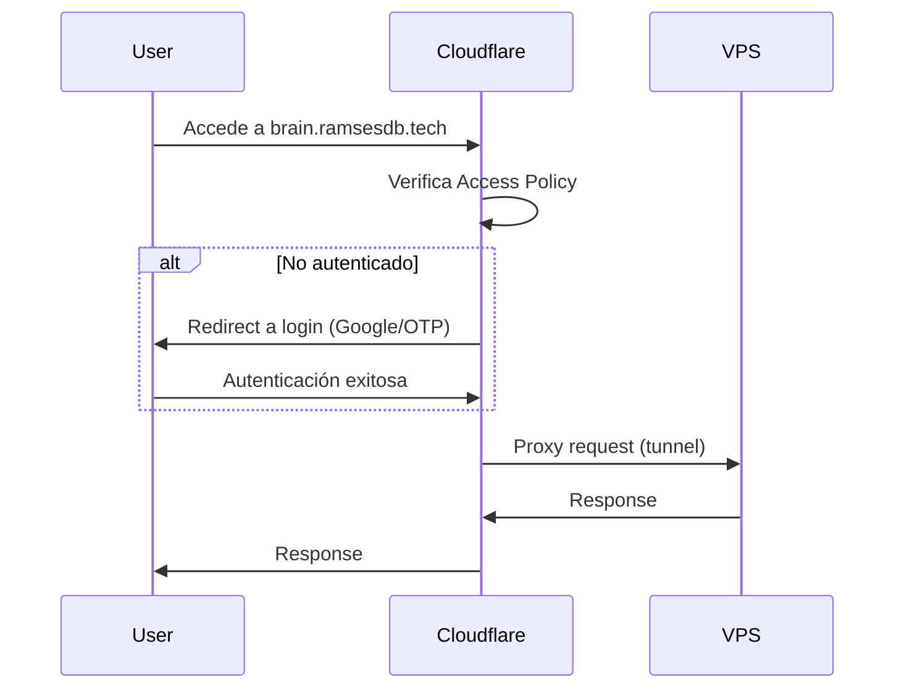

# 🚀 Nexus Ecosystem - Plan de Implementación 2026

> **Última actualización**: 16 Enero 2026 12:05
> **Estado**: ✅ Fase 2 Completa - Intelligence Layer Deployed (Gateway + WebUI + n8n)
> **Servidor**: Azure VPS (2 vCPU, 8GB RAM) - Coolify Managed

---

## 📋 Tabla de Contenidos

1. [Resumen Ejecutivo](#resumen-ejecutivo)
2. [Arquitectura del Sistema](#arquitectura-del-sistema)
3. [Stack Tecnológico](#stack-tecnológico)
4. [Configuración de Despliegue](#configuración-de-despliegue)
5. [Seguridad y Hardening](#seguridad-y-hardening)
6. [Estrategia de Migración](#estrategia-de-migración)
7. [Integración de Componentes](#integración-de-componentes)
8. [Roadmap](#roadmap)

---

## Resumen Ejecutivo

El **Nexus Ecosystem** es una plataforma de IA distribuida diseñada para domótica semántica, RAG de documentos, y automatización inteligente. El sistema está optimizado para funcionar dentro de las restricciones de un VPS de 8GB RAM.

### Decisiones Clave de Arquitectura

| Decisión | Justificación |
|---|---|
| ❌ **Dify descartado** | Requiere 13 contenedores y ~4-8GB RAM. Demasiado pesado para 8GB. |
| ✅ **Open WebUI elegido** | Solo ~500MB RAM. RAG avanzado con Hybrid Search + Reranking. |
| ✅ **n8n confirmado** | Mejor orquestador self-hosted. Integración MCP nativa en 2026. |
| ⏳ **Home Assistant diferido** | Se moverá al Home Lab local (Dell Optiplex) en Fase 3. |

### Consumo de RAM Estimado

| Componente | RAM |
|---|---|
| Coolify (PaaS) | ~500MB |
| Nexus AI Gateway | ~300MB |
| Open WebUI | ~500MB |
| n8n | ~1GB |
| OS + Overhead | ~1GB |
| **Total** | **~3.3GB** |
| **Disponible** | **~4.7GB** ✅ |

---

## Arquitectura del Sistema

### Fase 2: Cloud (Azure VPS) - Actual

```
┌─────────────────────────────────────────────────────────────────┐
│                    AZURE VPS (8GB RAM)                           │
│                                                                  │
│  ┌────────────────────────────────────────────────────────────┐ │
│  │                    🛡️ COOLIFY (PaaS)                       │ │
│  │  • Gestión de contenedores                                 │ │
│  │  • SSL automático                                          │ │
│  │  • Reverse Proxy integrado                                 │ │
│  └────────────────────────────────────────────────────────────┘ │
│                              │                                   │
│       ┌──────────────────────┼──────────────────────┐           │
│       ▼                      ▼                      ▼           │
│  ┌──────────────┐    ┌──────────────┐    ┌──────────────┐       │
│  │ 🚀 NEXUS     │    │ 🧠 OPEN      │    │ ⚙️ N8N       │       │
│  │ GATEWAY      │◄───┤ WEBUI        │◄───┤              │       │
│  │              │    │              │    │              │       │
│  │ • Multi-LLM  │    │ • Chat UI    │    │ • Webhooks   │       │
│  │ • Fallback   │    │ • RAG Docs   │    │ • MCP Server │       │
│  │ • Health     │    │ • Functions  │    │ • Workflows  │       │
│  │              │    │              │    │              │       │
│  │ api.ramsesdb │    │ brain.ramsesdb │  │ flows.ramsesdb │     │
│  │ .tech        │    │ .tech        │    │ .tech        │       │
│  │              │    │              │    │              │       │
│  │ 🌐 PÚBLICO   │    │ 🔒 SSO ONLY  │    │ 🔒 SSO ONLY  │       │
│  └──────────────┘    └──────────────┘    └──────────────┘       │
│                              │                                   │
│                              ▼                                   │
│                      ┌──────────────┐                           │
│                      │ 💾 SQLite    │                           │
│                      │ (Open WebUI) │                           │
│                      └──────────────┘                           │
└─────────────────────────────────────────────────────────────────┘
                               │
                               ▼
                 ┌───────────────────────┐
                 │   ☁️ LLM PROVIDERS    │
                 │  • Groq (Llama 3.3)   │
                 │  • Google Gemini      │
                 │  • Anthropic Claude   │
                 │  • Cerebras           │
                 └───────────────────────┘
```

### Fase 3: Híbrido (Cloud + Home Lab) - Futuro

```
┌─────────────────────────────────────────────────────────────────┐
│                DELL OPTIPLEX 3060 (16GB RAM)                     │
│                        HOME LAB LOCAL                            │
│                                                                  │
│  ┌────────────────────────────────────────────────────────────┐ │
│  │                 🏠 HOME ASSISTANT OS                        │ │
│  │  • AI Tasks (Core 2025.8+)                                 │ │
│  │  • LLM Vision (HACS - ha-llmvision)                        │ │
│  │  • Voice Assist                                            │ │
│  └────────────────────────────────────────────────────────────┘ │
│       │                      │                      │           │
│       ▼                      ▼                      ▼           │
│  ┌──────────────┐    ┌──────────────┐    ┌──────────────┐       │
│  │ 📡 ZIGBEE    │    │ 🦙 OLLAMA    │    │ 📊 QDRANT    │       │
│  │ 2MQTT        │    │              │    │              │       │
│  │              │    │ • Phi-3 Mini │    │ • Vector DB  │       │
│  │ • Sensores   │    │ • Gemma 2 2B │    │ • RAG Local  │       │
│  │ • Actuadores │    │ • Qwen 2.5   │    │ • Embeddings │       │
│  └──────────────┘    └──────────────┘    └──────────────┘       │
│                                                                  │
│  ┌────────────────────────────────────────────────────────────┐ │
│  │         🔄 MIGRADO DESDE VPS (Opcional)                    │ │
│  │  ┌──────────────┐              ┌──────────────┐            │ │
│  │  │ 🧠 Open      │              │ ⚙️ n8n       │            │ │
│  │  │ WebUI       │              │              │            │ │
│  │  │ + RAG LOCAL │              │              │            │ │
│  │  └──────────────┘              └──────────────┘            │ │
│  └────────────────────────────────────────────────────────────┘ │
└─────────────────────────────────────────────────────────────────┘
                               │
                               │ Tailscale VPN
                               ▼
                    ┌────────────────┐
                    │  Azure VPS     │
                    │  (Edge Relay)  │
                    │  Nexus Gateway │
                    └────────────────┘
```

---

## Stack Tecnológico

### Componentes Principales

| Componente | Tecnología | Versión | Puerto | Rol |
|---|---|---|---|---|
| **PaaS** | Coolify | Latest | 8000 | Orquestación de contenedores |
| **LLM Gateway** | Nexus AI Gateway | 1.x | 3000 | Routing multi-proveedor |
| **Chat + RAG** | Open WebUI | v0.7.x | 8080 | Interfaz de usuario + RAG |
| **Automation** | n8n | **1.121.x** ⚠️ | 5678 | Workflows + Agentes |

> [!IMPORTANT]
> **Estrategia de Versiones**: Pin por patch (ej. `1.121.1`) pero mantener **rutina de update mensual**.
> Revisar [n8n Security Advisories](https://github.com/n8n-io/n8n/security/advisories) antes de cada update.

### Por qué este Stack

#### Open WebUI (Reemplaza a Dify)

**Ventajas**:
- RAM: ~500MB vs ~4GB de Dify
- RAG con Hybrid Search (BM25 + embeddings)
- Reranking con CrossEncoder
- Citas en respuestas
- Python Functions para extensibilidad
- API OpenAI-compatible (conecta directo a Nexus Gateway)

**Características 2026**:
- Roadmap incluye "AI Workflow Tool" visual
- Soporte para múltiples Vector DBs (Qdrant, Milvus, Pinecone)
- Multi-source retrieval (local + web)

#### n8n (Orquestador)

**Ventajas**:
- 400+ integraciones nativas
- MCP (Model Context Protocol) nativo en 2026
- Nodo Home Assistant nativo
- LangChain nodes para agentes
- Agent-to-Agent delegation

**Nuevas Features 2026**:
- AI Workflow Builder (describe en lenguaje natural)
- Multi-Agent orchestration
- Vector Store directo (Pinecone, Qdrant, Supabase)

---

## Configuración de Despliegue

> [!IMPORTANT]
> **Single Stack Deployment**: Todos los servicios se despliegan en **un solo docker-compose**
> para garantizar que comparten la misma red Docker. Coolify aísla redes por proyecto por defecto.

### Stack Completo - Docker Compose

```yaml
# deploy/nexus-stack-docker-compose.yml
# ⚠️ DESPLEGAR COMO UN SOLO STACK EN COOLIFY
version: '3.8'

services:
  # === NEXUS AI GATEWAY ===
  nexus-gateway:
    image: ghcr.io/ramsesdb/nexus-ai-gateway:latest
    container_name: nexus-gateway
    restart: unless-stopped
    ports:
      - "127.0.0.1:3000:3000"  # 🔒 Bind a localhost (Cloudflare Tunnel entra igual)
    environment:
      - PORT=3000
      - CORS_ORIGIN=https://brain.ramsesdb.tech,https://ramsesdb.tech
      - GROQ_KEY_1=${GROQ_KEY_1}
      - GEMINI_KEY_1=${GEMINI_KEY_1}
      - OPENROUTER_KEY_1=${OPENROUTER_KEY_1}
    networks:
      - nexus-internal

  # === OPEN WEBUI ===
  open-webui:
    image: ghcr.io/open-webui/open-webui:v0.7.1
    container_name: open-webui
    restart: unless-stopped
    ports:
      - "127.0.0.1:8080:8080"  # 🔒 Bind a localhost
    volumes:
      - open-webui-data:/app/backend/data
    environment:
      # === Conexión a Nexus Gateway (hostname interno) ===
      - OPENAI_API_BASE_URL=http://nexus-gateway:3000/v1
      - OPENAI_API_KEY=${NEXUS_API_KEY}
      
      # === Autenticación ===
      - WEBUI_AUTH=true
      - WEBUI_SECRET_KEY=${WEBUI_SECRET_KEY}
      
      # === Configuración General ===
      - WEBUI_URL=https://brain.ramsesdb.tech
      - ENABLE_PERSISTENT_CONFIG=true
      
      # === RAG Embeddings (Opción 1: OpenAI directo) ===
      # El Gateway NO soporta /v1/embeddings, usar OpenAI directamente
      - RAG_EMBEDDING_ENGINE=openai
      - RAG_EMBEDDING_MODEL=text-embedding-3-small
      - RAG_OPENAI_API_KEY=${OPENAI_EMBEDDINGS_KEY}  # Key separada solo para embeddings
      - RAG_OPENAI_API_BASE_URL=https://api.openai.com/v1
      - CHUNK_SIZE=1000
      - CHUNK_OVERLAP=200
      
      # === Seguridad (CRÍTICO) ===
      - CORS_ALLOW_ORIGIN=https://brain.ramsesdb.tech
      - ENABLE_CODE_EXECUTION=false
      - ENABLE_DIRECT_CONNECTIONS=false  # Mitigación CVE-2025-64496
      
      # === n8n Integration (URL COMPLETA con path) ===
      - N8N_WEBHOOK_URL=http://n8n:5678/webhook/openwebui
      - N8N_WEBHOOK_TOKEN=${N8N_WEBHOOK_TOKEN}
      
    depends_on:
      - nexus-gateway
    networks:
      - nexus-internal

  # === N8N ===
  n8n:
    # ⚠️ Pin por patch, update mensual
    image: n8nio/n8n:1.121.1
    container_name: n8n
    restart: unless-stopped
    ports:
      - "127.0.0.1:5678:5678"  # 🔒 Bind a localhost
    volumes:
      - n8n-data:/home/node/.n8n
    environment:
      - NODE_ENV=production
      - GENERIC_TIMEZONE=America/Santo_Domingo
      - N8N_HOST=flows.ramsesdb.tech
      - N8N_PROTOCOL=https
      - WEBHOOK_URL=https://flows.ramsesdb.tech
      - N8N_EDITOR_BASE_URL=https://flows.ramsesdb.tech
      - N8N_SECURE_COOKIE=true
      - N8N_ENCRYPTION_KEY=${N8N_ENCRYPTION_KEY}
    networks:
      - nexus-internal

volumes:
  open-webui-data:
  n8n-data:

networks:
  nexus-internal:
    driver: bridge
    # Red interna compartida - NO external, se crea con el stack
```

> [!NOTE]
> **¿Por qué un solo compose?** Coolify crea redes aisladas por proyecto.
> Si despliegas Gateway, Open WebUI y n8n como apps separadas, el hostname `nexus-gateway`
> NO resolverá desde Open WebUI. Un solo stack = misma red = DNS interno funciona.

### Variables de Entorno (.env)

```bash
# .env (NO commitear a Git)

# === Nexus Gateway ===
GROQ_KEY_1=gsk_...
GEMINI_KEY_1=AIza...
OPENROUTER_KEY_1=sk-or-v1-...

# === Open WebUI ===
WEBUI_SECRET_KEY=your-64-char-secret-key-here
NEXUS_API_KEY=your-nexus-gateway-key

# === RAG Embeddings (OpenAI directo, bypass Gateway) ===
OPENAI_EMBEDDINGS_KEY=sk-proj-...  # Key separada solo para embeddings

# === n8n ===
N8N_ENCRYPTION_KEY=your-32-char-encryption-key
N8N_WEBHOOK_TOKEN=your-webhook-auth-token  # ⬅️ NUEVO: Para autenticar llamadas Open WebUI → n8n
```

---

## Seguridad y Hardening

### 🚨 CVE-2026-21858 - n8n (BLOCKER)

> [!CAUTION]
> **CVSS 10.0 - Crítico**. Afecta versiones >= 1.65.0 y < 1.121.0.
> Permite acceso no autenticado a archivos del servidor y RCE en ciertas configuraciones.

**Acción OBLIGATORIA**:
- ✅ Actualizar a **n8n >= 1.121.0** antes de desplegar
- ✅ Si no puedes actualizar: deshabilitar endpoints de webhooks/forms públicos

### ⚠️ CVE-2025-64496 - Open WebUI

> **Vulnerabilidad crítica** relacionada con "Direct Connections" y eventos SSE.
> Parcheada en v0.6.35+. Tu v0.7.1 está segura.

**Mitigaciones obligatorias**:
1. ✅ Actualizar a la última versión disponible
2. ✅ NO exponer directamente a Internet
3. ✅ Usar Cloudflare Access o SSO
4. ✅ Limitar creación de Functions/Tools a admins
5. ✅ `ENABLE_CODE_EXECUTION=false` para deshabilitar ejecución de código
6. ✅ Restringir permisos `workspace.tools` solo a usuarios confiados

### ⚠️ Cloudflare Access vs Webhooks

> [!WARNING]
> Si proteges `flows.*` con Cloudflare Access, Open WebUI NO podrá llamar a n8n webhooks
> (Access pedirá login). **Solución**: usar red interna Docker.

**Estrategia recomendada**:
- `flows.ramsesdb.tech` con Cloudflare Access → Solo para **editor UI**
- Webhooks internos → `http://n8n:5678/webhook/...` (misma red Docker)
- Open WebUI llama por hostname interno, no por URL pública

### Cloudflare Access Setup



**Pasos de configuración**:

1. **Crear Tunnel en Cloudflare Zero Trust**:
   - Dashboard > Network > Tunnels > Create
   - Instalar `cloudflared` en el VPS
   - Configurar rutas:
     - `brain.ramsesdb.tech` → `localhost:8081`
     - `flows.ramsesdb.tech` → `localhost:5678`

2. **Crear Application en Access**:
   - Dashboard > Access > Applications > Add
   - Tipo: Self-hosted
   - Dominio: `brain.ramsesdb.tech`

3. **Crear Policy**:
   - Rule: Include > Emails ending in `@tu-dominio.com`
   - O usar Google Workspace como IdP

### Checklist de Seguridad

- [ ] Open WebUI detrás de Cloudflare Access
- [ ] n8n detrás de Cloudflare Access
- [ ] `WEBUI_AUTH=true` configurado
- [ ] Secrets en variables de entorno (no hardcoded)
- [ ] Firewall: solo puertos 80/443 abiertos
- [ ] Actualizaciones automáticas habilitadas
- [ ] Backups diarios de volúmenes Docker

---

## Estrategia de Migración

### DNS-Based Migration (Zero Downtime)

> La clave: **Las URLs nunca cambian. Solo cambia dónde apunta el túnel.**

| Subdominio | Fase 2 (Ahora) | Fase 3 (Futuro) |
|---|---|---|
| `api.ramsesdb.tech` | VPS (Gateway) | VPS (Gateway) - **Siempre cloud** |
| `brain.ramsesdb.tech` | VPS (Open WebUI) | Optiplex via Tunnel |
| `flows.ramsesdb.tech` | VPS (n8n) | Optiplex via Tunnel |
| `ha.ramsesdb.tech` | N/A | Optiplex via Tunnel |

**Beneficio**: Gexu, Telegram, Portfolio nunca se enteran de la mudanza.

### Puente Cloud ↔ Home Lab

| Tecnología | Uso Recomendado |
|---|---|
| **Tailscale** ⭐ | VPN real entre VPS y Optiplex. Mejor para n8n + Open WebUI. |
| **Cloudflare Tunnel** | Exponer servicios públicos. Complementa a Tailscale. |
| **Nabu Casa** | Solo para Home Assistant. No cubre otros servicios. |

**Configuración recomendada**:
- Tailscale como backbone privado (comunicación interna)
- Cloudflare Tunnel para acceso público (con Access)

---

## Integración de Componentes

### Patrón: Open WebUI → n8n (Webhook Router)

> [!TIP]
> **1 webhook "router"**: Un solo endpoint en n8n que enruta por `body.workflow`.
> Evita gestionar múltiples webhooks.

```python
# Tool/Function para Open WebUI que llama a n8n
import os
import requests

class Tools:
    def __init__(self):
        # URL COMPLETA incluyendo path (http://n8n:5678/webhook/openwebui)
        self.webhook_url = os.getenv("N8N_WEBHOOK_URL")
        self.token = os.getenv("N8N_WEBHOOK_TOKEN")

    def ejecutar_workflow(self, workflow_name: str, datos: dict) -> dict:
        """
        Ejecuta un workflow de n8n desde Open WebUI.
        
        Args:
            workflow_name: Nombre del workflow a ejecutar (ej. "home_assistant_action")
            datos: Datos a enviar al workflow
            
        Returns:
            Resultado del workflow
        """
        # Validate config early to avoid silent failures
        if not self.webhook_url or not self.token:
            return {"ok": False, "error": "Missing N8N_WEBHOOK_URL or N8N_WEBHOOK_TOKEN"}

        headers = {
            "Authorization": f"Bearer {self.token}",
            "Content-Type": "application/json",
        }
        
        payload = {
            "workflow": workflow_name,
            "data": datos,
        }

        try:
            r = requests.post(self.webhook_url, json=payload, headers=headers, timeout=30)
            r.raise_for_status()
            # Keep response shape thin for UI safety
            return {"ok": True, "data": r.json()}
        except requests.RequestException as e:
            return {"ok": False, "error": str(e)}
```

### Configuración en n8n (Webhook Router)

1. **Crear Webhook Node (Router)**:
   - Method: POST
   - Path: `/openwebui`  *(URL final: `http://n8n:5678/webhook/openwebui`)*
   - Authentication: Header Auth
   - Header Name: `Authorization`
   - Header Value: `Bearer {{ $env.N8N_WEBHOOK_TOKEN }}`

2. **Agregar Switch Node**:
   - Routing por `{{ $json.body.workflow }}`
   - Casos: `home_assistant_action`, `send_telegram`, `query_notion`, etc.

3. **Conectar a Sub-workflows**:
   - Cada caso del Switch llama a un workflow específico

4. **Terminar con "Respond to Webhook"**:
   - Devolver `{ "success": true, "result": ... }`

### Conexión Gateway ↔ Open WebUI

```
Open WebUI
    │
    │ HTTP Request (OpenAI-compatible)
    │ POST /v1/chat/completions
    │ Header: Authorization: Bearer ${NEXUS_API_KEY}
    │
    ▼
Nexus Gateway (api.ramsesdb.tech)
    │
    │ Health-aware routing
    │ Circuit breaker
    │ Provider selection
    │
    ├──► Groq (Llama 3.3 70B)
    ├──► Google Gemini 2.0
    └──► Anthropic Claude 3.5
```

---

## Roadmap

### Fase 2: Deployment (✅ Completa)

> Infraestructura desplegada y funcionando.

| Tarea | Estado | Prioridad |
|---|---|---|
| Desplegar Open WebUI en Coolify | ✅ Hecho | P0 |
| Desplegar n8n en Coolify | ✅ Hecho | P0 |
| Stack Unificado Docker | ✅ Hecho | P0 |
| DNS Configurado (subdomains) | ✅ Hecho | P0 |
| Fix Traefik routing (`healthcheck: disable`) | ✅ Hecho | P0 |

---

### Fase 2.5: Configuration & Integration (⏳ En Progreso)

> Configuración post-deployment para que los servicios funcionen end-to-end.

#### 🔧 Configuración Inicial

| Tarea | Estado | Prioridad | Notas |
|---|---|---|---|
| Crear cuenta admin en Open WebUI | ⏳ Pendiente | P0 | Acceder a `brain.ramsesdb.tech` |
| Crear cuenta owner en n8n | ⏳ Pendiente | P0 | Acceder a `flows.ramsesdb.tech` |
| Configurar conexión OpenAI en Open WebUI | ⏳ Pendiente | P0 | Apuntar a `http://nexus-gateway:3000/v1` |
| Verificar chat funciona en Open WebUI | ⏳ Pendiente | P0 | Probar con modelo cualquiera |

#### 🔗 Integración de Servicios

| Tarea | Estado | Prioridad | Notas |
|---|---|---|---|
| Crear webhook router en n8n | ⏳ Pendiente | P1 | Path: `/webhook/openwebui` |
| Crear Function Open WebUI → n8n | ⏳ Pendiente | P1 | Ver código en sección "Integración" |
| Probar integración OpenWebUI ↔ n8n | ⏳ Pendiente | P1 | Llamar workflow desde chat |

#### 📚 RAG & Knowledge Base

| Tarea | Estado | Prioridad | Notas |
|---|---|---|---|
| Configurar RAG embeddings (OpenAI) | ⏳ Pendiente | P1 | Requiere `OPENAI_EMBEDDINGS_KEY` |
| Subir documentos de prueba | ⏳ Pendiente | P2 | PDFs, Markdown, etc. |
| Probar consultas RAG | ⏳ Pendiente | P2 | Verificar citaciones |

#### 🔒 Seguridad (Opcional pero Recomendado)

| Tarea | Estado | Prioridad | Notas |
|---|---|---|---|
| Configurar Cloudflare Access | ⏳ Pendiente | P1 | SSO para `brain.*` y `flows.*` |
| Habilitar 2FA en Open WebUI | ⏳ Pendiente | P2 | Settings → Security |
| Revisar permisos de usuarios | ⏳ Pendiente | P2 | Limitar code execution |

#### ✅ Verificación Final

| Tarea | Estado | Prioridad | Notas |
|---|---|---|---|
| Chat Portfolio funciona (`ramsesdb.tech`) | ⏳ Pendiente | P0 | Probar "Ask Ramses" |
| Gateway responde con providers | ⏳ Pendiente | P0 | Verificar telemetry headers |
| Workflows básicos en n8n | ⏳ Pendiente | P2 | Ej: notificación Telegram |

---

### Fase 3: Home Lab Integration (Futuro)

> Migración parcial a hardware local para privacidad y control.

| Tarea | Estado | Prioridad |
|---|---|---|
| Adquirir Dell Optiplex 3060 | ⏳ Pendiente | P0 |
| Instalar Proxmox VE | ⏳ Pendiente | P0 |
| Instalar Home Assistant OS (VM) | ⏳ Pendiente | P1 |
| Configurar Zigbee2MQTT | ⏳ Pendiente | P1 |
| Instalar Ollama + modelos locales | ⏳ Pendiente | P1 |
| Configurar Tailscale VPN | ⏳ Pendiente | P1 |
| Migrar Open WebUI a Optiplex (opcional) | ⏳ Pendiente | P2 |
| Configurar Qdrant local | ⏳ Pendiente | P2 |
| Integrar n8n → Home Assistant | ⏳ Pendiente | P2 |

---

## Referencias

- [Open WebUI Documentation](https://docs.openwebui.com)
- [n8n Self-Hosting Guide](https://docs.n8n.io/hosting/)
- [Cloudflare Zero Trust](https://developers.cloudflare.com/cloudflare-one/)
- [Tailscale Documentation](https://tailscale.com/kb)
- [Home Assistant Integration](https://www.home-assistant.io/integrations/)

---

> **Nota**: Este documento es la fuente de verdad para la implementación del Nexus Ecosystem. Mantenerlo actualizado conforme avanza el proyecto.
