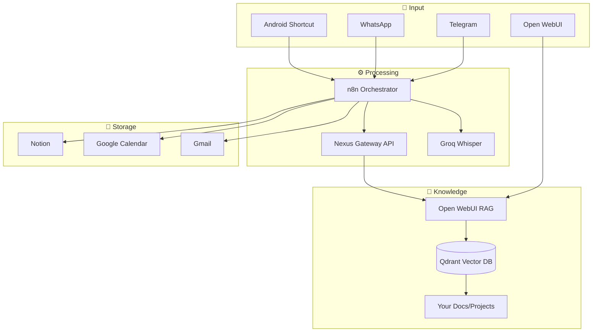

# 🤖 JARVIS - Nexus AI Personal Assistant

> A comprehensive personal AI assistant powered by Nexus Gateway, n8n, and Open WebUI.

---

## 📊 Current Status

| Component | Status | URL |
|-----------|--------|-----|
| **Nexus Gateway** | ✅ Running | `api.ramsesdb.tech` |
| **n8n** | ✅ Running | `flows.ramsesdb.tech` |
| **Open WebUI** | ✅ Running | `chat.ramsesdb.tech` |
| **Telegram Bot** | ✅ Working | `@nexusrdb_bot` |

---

## 🏗️ Architecture

---

## ✅ Features & Workflows

### 🎙️ Voice Transcription
**Status:** `[ ] Not Started`
- [ ] Handle Telegram voice messages
- [ ] Send audio to Groq Whisper API
- [ ] Convert to text and process

### 🧠 Second Brain (RAG)
**Status:** `[ ] Not Started`
- [ ] Configure Open WebUI RAG
- [ ] Upload personal knowledge (projects, resume, notes)
- [ ] Create "Personal Knowledge Base" collection
- [ ] Enable Jarvis to query knowledge via API

### 📝 Note Capture
**Status:** `[ ] Not Started`
- [ ] "Guarda esto: ..." → Save to Notion
- [ ] Auto-tag and categorize notes
- [ ] Voice note support

### ✅ Task Management
**Status:** `[ ] Not Started`
- [ ] "Agrégame tarea: ..." → Notion Tasks DB
- [ ] Parse due dates ("mañana", "viernes")
- [ ] Priority detection

### 📅 Calendar Integration
**Status:** `[ ] Not Started`
- [ ] Connect Google Calendar
- [ ] "Agenda reunión..." → Create event
- [ ] Daily briefing with today's events

### 📰 Daily Briefing
**Status:** `[ ] Not Started`
- [ ] Scheduled trigger (8:00 AM)
- [ ] Fetch: Weather, Calendar, News
- [ ] AI-generated summary
- [ ] Send to Telegram

### 🔗 URL Summarizer
**Status:** `[ ] Not Started`
- [ ] Send link to Jarvis
- [ ] Scrape webpage content
- [ ] AI summary → Reply

### 📧 Email Assistant
**Status:** `[ ] Not Started`
- [ ] Connect Gmail
- [ ] Auto-label incoming emails
- [ ] Daily email digest

### 🏠 Home Assistant (Phase 3)
**Status:** `[ ] Not Started`
- [ ] Connect to Home Assistant API
- [ ] Voice commands for lights, devices
- [ ] "Activa modo película"

---

## 🔐 Required Credentials

| Service | Status | Where to Get |
|---------|--------|--------------|
| `TELEGRAM_BOT_TOKEN` | ✅ Done | BotFather |
| `NEXUS_API_KEY` | ✅ Done | Configured |
| `NOTION_API_KEY` | ⬜ Pending | [notion.so/my-integrations](https://notion.so/my-integrations) |
| `GOOGLE_OAUTH` | ⬜ Pending | [Google Cloud Console](https://console.cloud.google.com/) |
| `GROQ_API_KEY` | ✅ Done | Via Nexus Gateway |

---

## 📋 Implementation Priority

1. **🎙️ Voice Transcription** - Quick win, high impact
2. **🧠 Second Brain RAG** - Foundation for knowledge
3. **📝 Note Capture + Tasks** - Daily utility
4. **📅 Calendar** - Time management
5. **📰 Daily Briefing** - Proactive assistant
6. **🔗 URL Summarizer** - Research helper
7. **🏠 Home Assistant** - Phase 3

---

## 📝 Changelog

| Date | Change |
|------|--------|
| 2026-01-16 | ✅ Created Telegram Bot (@nexusrdb_bot) |
| 2026-01-16 | ✅ Basic n8n workflow (Text → Nexus → Reply) |
| 2026-01-16 | 📝 Created this feature document |
