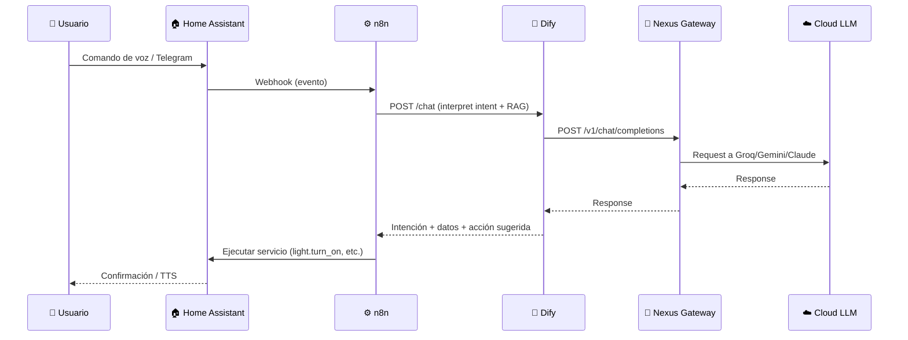

# 🏡 Nexus Ecosystem - Fase 3: Home Lab Local (Dell Optiplex)

> **Objetivo**: Migrar el "cerebro" del ecosistema a un servidor local para máxima privacidad.  
> **Hardware**: Dell Optiplex 3060 (Intel i5-8500, 16GB RAM, 256GB+ NVMe SSD)  
> **Estrategia OS**: Proxmox VE (Virtualización) con dos mundos aislados.  
> **Estado**: Planificación (Ejecutar después de Fase 2)

---

## 📋 Tabla de Contenidos

1. [Análisis del Plan Propuesto](#análisis-del-plan-propuesto)
2. [Arquitectura Proxmox "Dual World"](#arquitectura-proxmox-dual-world)
3. [Sizing de Recursos por VM](#sizing-de-recursos-por-vm)
4. [Layout de Servicios](#layout-de-servicios)
5. [Flujo de Datos Recomendado](#flujo-de-datos-recomendado)
6. [Docker Compose Base](#docker-compose-base)
7. [Estructura de Carpetas (GitOps)](#estructura-de-carpetas-gitops)
8. [Migración desde VPS](#migración-desde-vps)
9. [Backups y Mantenimiento](#backups-y-mantenimiento)
10. [Checklist de Implementación](#checklist-de-implementación)

---

## ✅ Análisis del Plan Propuesto

### Veredicto: **ÓPTIMO** ✅

El plan propuesto es **técnicamente sólido** y representa la mejor práctica para un Home Lab de IA + Domótica en 2026. Aquí está mi análisis punto por punto:

| Aspecto | Evaluación | Comentario |
|---|---|---|
| **Proxmox como hipervisor** | ✅ Correcto | Mejor opción para aislar domótica de IA experimental. |
| **HAOS en VM separada** | ✅ Correcto | USB passthrough funciona bien. Supervisor + Add-ons incluidos. |
| **Dify como Brain local** | ✅ Correcto | Con 16GB ya es viable. RAG serio + apps versionables. |
| **Qdrant sobre Weaviate** | ✅ Correcto | Más ligero y fácil de operar en homelab. Dify lo soporta. |
| **n8n como Nerves** | ✅ Correcto | Patrón "Dify decide qué, n8n decide cómo" es elegante. |
| **VPS solo como edge** | ✅ Correcto | Gateway + seguridad. Sin cerebro, solo routing. |
| **Tailscale para túnel** | ✅ Correcto | Red privada real. Mejor que exponer puertos. |
| **Sizing 4GB HAOS / 10GB AI** | ✅ Correcto | Deja ~2GB para Proxmox host. Viable. |

### Lo que agregaría:

1. **Memory Ballooning**: Habilitar en las VMs para reclamar RAM no usada.
2. **ZFS con compresión**: Si el SSD lo permite, ZFS ofrece snapshots y deduplicación.
3. **Whisper/Piper local**: Agregar a HAOS cuando esté estable para voz 100% local.

---

## 🏗️ Arquitectura Proxmox "Dual World"

```
┌─────────────────────────────────────────────────────────────────┐
│           DELL OPTIPLEX 3060 - PROXMOX VE 8.x                   │
│             i5-8500 (6 cores) | 16GB RAM | 256GB NVMe           │
│                                                                  │
│  ┌────────────────────────────────────────────────────────────┐ │
│  │                    🖥️ PROXMOX HOST                         │ │
│  │  • ZFS storage (snapshots, compression)                    │ │
│  │  • Memory ballooning habilitado                            │ │
│  │  • Reserva: ~2GB RAM                                       │ │
│  └────────────────────────────────────────────────────────────┘ │
│                              │                                   │
│       ┌──────────────────────┴──────────────────────┐           │
│       ▼                                              ▼           │
│  ┌─────────────────┐                    ┌─────────────────────┐ │
│  │ 📦 VM 1: HAOS  │                    │ 🧠 VM 2: NEXUS AI   │ │
│  │                 │                    │                     │ │
│  │ 2 vCPU | 4GB   │                    │ 4 vCPU | 10GB       │ │
│  │ 32GB Disk      │                    │ 150GB Disk          │ │
│  │                 │                    │                     │ │
│  │ • Home Assist. │                    │ • Ubuntu Server     │ │
│  │ • Zigbee2MQTT  │                    │ • Docker + Compose  │ │
│  │ • Mosquitto    │                    │ • Dify (13 cont.)   │ │
│  │ • ESPHome      │       API          │ • n8n               │ │
│  │ • Whisper/Piper│◄──────────────────►│ • Qdrant            │ │
│  │                 │                    │ • Postgres + Redis  │ │
│  │ 🔌 USB Zigbee  │                    │ • Cloudflared       │ │
│  │ (Passthrough)  │                    │ • Tailscale         │ │
│  └─────────────────┘                    └─────────────────────┘ │
└─────────────────────────────────────────────────────────────────┘
                               │
                               │ Tailscale VPN (10.x.x.x)
                               ▼
┌─────────────────────────────────────────────────────────────────┐
│                    AZURE VPS (8GB RAM)                           │
│                         "EDGE"                                   │
│                                                                  │
│  ┌────────────────────────────────────────────────────────────┐ │
│  │ 🚀 Nexus AI Gateway                                        │ │
│  │ • OpenAI-compatible API                                    │ │
│  │ • Multi-provider routing (Groq, Gemini, Claude)            │ │
│  │ • Rate limiting, auth, health-aware load balancing         │ │
│  └────────────────────────────────────────────────────────────┘ │
│  ┌────────────────────────────────────────────────────────────┐ │
│  │ 📊 Observabilidad ligera (Prometheus/Grafana opcional)     │ │
│  └────────────────────────────────────────────────────────────┘ │
└─────────────────────────────────────────────────────────────────┘
```

---

## 📊 Sizing de Recursos por VM

### VM 1: Home Assistant OS (HAOS)

| Recurso | Valor | Justificación |
|---|---|---|
| **vCPU** | 2 cores | Suficiente para automatizaciones y add-ons. |
| **RAM** | 4GB | HAOS + Z2M + Mosquitto + ESPHome caben bien. |
| **Disco** | 32GB | Logs + backups + add-ons. |
| **USB** | Passthrough | Dongle Zigbee (Sonoff/SkyConnect). |
| **Red** | Bridge | Acceso LAN directo para mDNS. |

### VM 2: Nexus AI Server (Docker Host)

| Recurso | Valor | Justificación |
|---|---|---|
| **vCPU** | 4 cores | Dify workers + n8n + embeddings. |
| **RAM** | 10GB | Dify (~4GB) + n8n (~1GB) + Qdrant (~1GB) + buffers. |
| **Disco** | 150GB | RAG documents + vector store + Postgres. |
| **Red** | Bridge | Tailscale + Cloudflared para túneles. |

### Host Proxmox

| Recurso | Valor | Uso |
|---|---|---|
| **RAM Reservado** | ~2GB | Proxmox host + ZFS ARC cache. |
| **Disco Boot** | 16GB | Proxmox OS en partición separada. |

---

## 🛠️ Layout de Servicios

### En VM "Nexus AI" (Docker Compose)

```
┌─────────────────────────────────────────────────┐
│           DOCKER COMPOSE STACK                  │
│                                                 │
│  ┌──────────────┐  ┌──────────────┐            │
│  │ 🔄 Traefik   │  │ 🌐 Cloudflared│            │
│  │ Rev. Proxy   │  │ Tunnels       │            │
│  └──────────────┘  └──────────────┘            │
│         │                  │                    │
│         ▼                  ▼                    │
│  ┌──────────────────────────────────────────┐  │
│  │            🧠 DIFY (13 containers)       │  │
│  │  • api • worker • web • plugin-daemon   │  │
│  │  • sandbox • ssrf-proxy • nginx         │  │
│  │  Conecta a: Nexus Gateway (cloud LLMs)  │  │
│  └──────────────────────────────────────────┘  │
│         │                                       │
│         ▼                                       │
│  ┌──────────────┐  ┌──────────────┐            │
│  │ ⚙️ n8n       │  │ 📊 Qdrant    │            │
│  │ Workflows    │  │ Vector DB    │            │
│  └──────────────┘  └──────────────┘            │
│         │                  │                    │
│         ▼                  ▼                    │
│  ┌──────────────┐  ┌──────────────┐            │
│  │ 🐘 Postgres  │  │ 🔴 Redis     │            │
│  │ (Compartido) │  │ (Cache)      │            │
│  └──────────────┘  └──────────────┘            │
└─────────────────────────────────────────────────┘
```

### En VM "HAOS" (Add-ons nativos)

| Add-on | Rol |
|---|---|
| **Zigbee2MQTT** | Bridge Zigbee → MQTT. |
| **Mosquitto Broker** | MQTT central (sensores, ESP). |
| **ESPHome** | Firmware para dispositivos ESP32. |
| **Whisper** | STT local (voz → texto). |
| **Piper** | TTS local (texto → voz). |
| **Wyoming** | Protocolo para voice satellites. |

---

## 🔄 Flujo de Datos Recomendado



**Patrón clave**:
- **Dify decide "QUÉ"**: Interpreta intención, busca en RAG, sugiere acción.
- **n8n decide "CÓMO"**: Maneja credenciales, ejecuta workflows, orquesta.
- **HA ejecuta**: Controla el mundo físico.

---

## 🐳 Docker Compose Base

Este es el "suelo" de infraestructura compartida. Dify se monta encima usando su compose oficial.

```yaml
# deploy/optiplex/docker-compose.base.yml

services:
  # === BASE DE DATOS COMPARTIDA ===
  postgres:
    image: postgres:16-alpine
    restart: unless-stopped
    environment:
      POSTGRES_USER: ${POSTGRES_USER}
      POSTGRES_PASSWORD: ${POSTGRES_PASSWORD}
      POSTGRES_DB: ${POSTGRES_DB}
    volumes:
      - pg_data:/var/lib/postgresql/data
    networks: [internal]
    healthcheck:
      test: ["CMD-SHELL", "pg_isready -U ${POSTGRES_USER}"]
      interval: 10s
      timeout: 5s
      retries: 5

  redis:
    image: redis:7-alpine
    restart: unless-stopped
    command: ["redis-server", "--appendonly", "yes"]
    volumes:
      - redis_data:/data
    networks: [internal]

  # === VECTOR DATABASE ===
  qdrant:
    image: qdrant/qdrant:latest
    restart: unless-stopped
    volumes:
      - qdrant_data:/qdrant/storage
    networks: [internal]
    # Puerto 6333 interno para Dify

  # === AUTOMATIZACIÓN ===
  n8n:
    image: n8nio/n8n:1.116.2
    restart: unless-stopped
    environment:
      - NODE_ENV=production
      - GENERIC_TIMEZONE=America/Santo_Domingo
      - DB_TYPE=postgresdb
      - DB_POSTGRESDB_HOST=postgres
      - DB_POSTGRESDB_DATABASE=${N8N_DB}
      - DB_POSTGRESDB_USER=${POSTGRES_USER}
      - DB_POSTGRESDB_PASSWORD=${POSTGRES_PASSWORD}
      - N8N_HOST=flows.ramsesdb.tech
      - WEBHOOK_URL=https://flows.ramsesdb.tech/
      - N8N_SECURE_COOKIE=true
      - N8N_ENCRYPTION_KEY=${N8N_ENCRYPTION_KEY}
    volumes:
      - n8n_data:/home/node/.n8n
    depends_on:
      postgres:
        condition: service_healthy
    networks: [internal]
    labels:
      - "traefik.enable=true"
      - "traefik.http.routers.n8n.rule=Host(`flows.ramsesdb.tech`)"

  # === TÚNELES ===
  cloudflared:
    image: cloudflare/cloudflared:latest
    restart: unless-stopped
    command: tunnel run
    environment:
      - TUNNEL_TOKEN=${CLOUDFLARE_TUNNEL_TOKEN}
    networks: [internal]

  tailscale:
    image: tailscale/tailscale:latest
    restart: unless-stopped
    hostname: nexus-optiplex
    environment:
      - TS_AUTHKEY=${TAILSCALE_AUTHKEY}
      - TS_STATE_DIR=/var/lib/tailscale
    volumes:
      - tailscale_data:/var/lib/tailscale
      - /dev/net/tun:/dev/net/tun
    cap_add:
      - NET_ADMIN
      - SYS_MODULE
    networks: [internal]

networks:
  internal:
    driver: bridge

volumes:
  pg_data:
  redis_data:
  qdrant_data:
  n8n_data:
  tailscale_data:
```

### Variables de Entorno (.env)

```bash
# .env (NO commitear a Git)

# === Postgres ===
POSTGRES_USER=nexus
POSTGRES_PASSWORD=your-secure-password-here
POSTGRES_DB=nexus

# === n8n ===
N8N_DB=n8n
N8N_ENCRYPTION_KEY=your-32-char-encryption-key

# === Dify ===
DIFY_SECRET_KEY=your-64-char-secret-key
VECTOR_STORE=qdrant
QDRANT_URL=http://qdrant:6333

# === Túneles ===
CLOUDFLARE_TUNNEL_TOKEN=your-tunnel-token
TAILSCALE_AUTHKEY=tskey-auth-xxxxx
```

---

## 📁 Estructura de Carpetas (GitOps)

```
nexus-ecosystem/
├── infra/
│   ├── proxmox/
│   │   ├── vm-haos.md           # Notas de instalación HAOS
│   │   ├── vm-nexus.md          # Notas de instalación Ubuntu
│   │   └── sizing.md            # Documento de sizing
│   ├── cloudflare/
│   │   ├── tunnels.md           # Configuración de túneles
│   │   └── access-policies.md   # Zero Trust policies
│   └── dns/
│       └── records.md           # Subdominios
│
├── deploy/
│   ├── vps/
│   │   ├── docker-compose.yml   # Nexus Gateway
│   │   └── .env.example
│   └── optiplex/
│       ├── docker-compose.base.yml
│       ├── docker-compose.dify.yml  # Override para Dify
│       ├── .env.example
│       └── volumes/             # Bind mounts (NO git)
│
├── services/
│   ├── nexus-gateway/           # Código del Gateway
│   └── nexus-functions/         # Functions de Open WebUI → Dify
│
├── docs/
│   ├── IMPLEMENTATION_PLAN_2026.md
│   ├── PHASE_3_HOMELAB_PLAN.md  # Este archivo
│   ├── architecture.md
│   ├── runbooks.md
│   └── threat-model.md
│
└── .gitignore                   # Ignorar .env, volumes/
```

---

## 🔄 Migración desde VPS

### Subdominios y Túneles

| Subdominio | Fase 2 (VPS) | Fase 3 (Optiplex) | Cambio |
|---|---|---|---|
| `api.ramsesdb.tech` | Gateway (VPS) | Gateway (VPS) | **Sin cambio** |
| `brain.ramsesdb.tech` | Open WebUI (VPS) | Dify (Optiplex) | Tunnel → Optiplex |
| `flows.ramsesdb.tech` | n8n (VPS) | n8n (Optiplex) | Tunnel → Optiplex |
| `ha.ramsesdb.tech` | N/A | HA (Optiplex) | Nuevo |

### Pasos de Migración

1. **Backup de VPS**:
   - `n8n`: Export workflows + credentials backup.
   - `Open WebUI`: Export RAG documents (si aplica).

2. **Preparar Optiplex**:
   - Instalar Proxmox, crear VMs.
   - Deploy Docker Compose base + Dify.
   - Restore n8n backup.

3. **Cambiar Túneles**:
   - En Cloudflare: Apuntar `brain.*` y `flows.*` a Optiplex.
   - Verificar conectividad.

4. **Decommission VPS services**:
   - Mantener solo Gateway en VPS.
   - Opcional: Reducir tier del VPS.

---

## 🔒 Backups y Mantenimiento

### Backup Strategy

| Componente | Método | Frecuencia |
|---|---|---|
| **Proxmox VMs** | `vzdump` snapshots | Semanal |
| **Postgres** | `pg_dump` a S3/local | Diario |
| **Qdrant** | Snapshot de volumen | Diario |
| **n8n** | Export workflows | Antes de cambios |
| **HAOS** | Panel de backups | Semanal |
| **Dify Knowledge** | Export datasets | Antes de cambios |

### Script de Backup (Ejemplo)

```bash
#!/bin/bash
# deploy/optiplex/backups/backup.sh

DATE=$(date +%Y%m%d)
BACKUP_DIR=/mnt/backups/$DATE

mkdir -p $BACKUP_DIR

# Postgres
docker exec postgres pg_dumpall -U nexus > $BACKUP_DIR/postgres.sql

# Qdrant
docker exec qdrant tar czvf - /qdrant/storage > $BACKUP_DIR/qdrant.tar.gz

# n8n
docker exec n8n n8n export:workflow --all --output=$BACKUP_DIR/n8n-workflows.json

echo "Backup completed: $BACKUP_DIR"
```

---

## ☑️ Checklist de Implementación

### Pre-requisitos

- [ ] Dell Optiplex 3060 adquirido
- [ ] 16GB RAM instalada
- [ ] NVMe SSD 256GB+ instalado
- [ ] Dongle Zigbee (Sonoff/SkyConnect)
- [ ] Cable ethernet conectado

### Instalación Proxmox

- [ ] Descargar Proxmox VE 8.x ISO
- [ ] Crear USB booteable (Rufus, DD mode)
- [ ] Instalar Proxmox con ZFS
- [ ] Configurar repositories no-subscription
- [ ] Habilitar VT-x/VT-d en BIOS

### VM 1: HAOS

- [ ] Descargar HAOS qcow2 image
- [ ] Crear VM con tteck helper script
- [ ] Configurar USB passthrough para Zigbee
- [ ] Onboarding de Home Assistant
- [ ] Instalar add-ons: Z2M, Mosquitto, ESPHome
- [ ] Configurar backups automáticos

### VM 2: Nexus AI

- [ ] Instalar Ubuntu Server 24.04 LTS
- [ ] Instalar Docker + Docker Compose
- [ ] Deploy docker-compose.base.yml
- [ ] Deploy Dify (compose oficial adaptado)
- [ ] Configurar Qdrant como vector store
- [ ] Restore n8n desde VPS
- [ ] Configurar Tailscale
- [ ] Configurar Cloudflared

### Red y Túneles

- [ ] Conectar VPS y Optiplex via Tailscale
- [ ] Configurar Dify para usar Gateway via Tailscale IP
- [ ] Actualizar túneles de Cloudflare
- [ ] Verificar `brain.ramsesdb.tech` → Dify
- [ ] Verificar `flows.ramsesdb.tech` → n8n
- [ ] Verificar `ha.ramsesdb.tech` → Home Assistant

### Integración

- [ ] Crear workflow n8n: HA Event → Dify → HA Action
- [ ] Probar flujo completo de voz (opcional)
- [ ] Documentar runbooks en `/docs`

---

## 🎯 Conclusión

El plan propuesto es **óptimo** para tu caso. La estructura Proxmox "Dual World" te da:

1. **Estabilidad**: HAOS aislado, tu casa no se rompe por experimentos de IA.
2. **Privacidad**: El cerebro (Dify + RAG) vive 100% local.
3. **Escalabilidad**: Puedes agregar GPU en el futuro y correr Ollama/vLLM.
4. **Mantenibilidad**: GitOps simple, backups claros, migraciones por DNS.

### Próximo Paso Inmediato

Primero termina **Fase 2** (Open WebUI + n8n en VPS) para validar los workflows. Cuando tengas el Optiplex, esta guía es tu blueprint.
