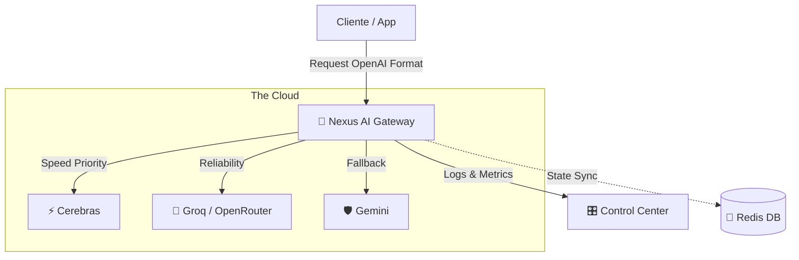

# 🌌 Nexus Ecosystem Architecture

## 🔭 Visión General
El **Nexus Ecosystem** es una suite de herramientas de infraestructura de Inteligencia Artificial diseñada para orquestar, optimizar y democratizar el acceso a múltiples Modelos de Lenguaje (LLMs). Su objetivo es eliminar la dependencia de un solo proveedor (Vendor Lock-in) y garantizar alta disponibilidad.

## 🧩 Componentes del Ecosistema

### 1. 🧠 Nexus AI Gateway (`/AI_infi`)
*El "Cerebro" del ecosistema.*
- **Función:** Proxy inteligente y balanceador de carga unificado.
- **Tecnología:** Bun, TypeScript.
- **Capacidades:**
    - **Smart Router:** Decide qué proveedor usar (Cerebras, Groq, Gemini) según velocidad y costo.
    - **Circuit Breaker:** Detecta fallos en proveedores y redirige el tráfico automáticamente.
    - **Normalización:** Convierte todas las respuestas al formato estándar de OpenAI.
- **Estado:** ✅ Producción (Azure).

### 2. 🎛️ Nexus Control Center
*La "Cara" del ecosistema.*
- **Función:** Interfaz gráfica para gestión y monitorización en tiempo real.
- **Tecnología:** HTML5/JS (V1), React/Next.js (Futuro V2).
- **Capacidades:**
    - Chat de prueba multimodal.
    - Visualización de métricas (Latencia, Uptime).
    - Toggles para apagar/encender proveedores manualmente.
- **Estado:** ✅ Beta (Integrado en Gateway).

### 3. 🛡️ Nexus Sentinel (Planificado)
*El "Escudo".*
- **Función:** Seguridad y Observabilidad avanzada.
- **Tecnología:** Redis (Cache/State), Uptime Kuma (Monitorización).
- **Objetivo:**
    - Rate Limiting por usuario.
    - Detección de abusos.
    - Alertas de caída por Telegram/Discord.

## 🔄 Flujo de Datos

## 🚀 Hoja de Ruta (Roadmap)
- [x] **Fase 1:** Despliegue de Gateway en Cloud (Azure).
- [ ] **Fase 2:** Persistencia con Redis (Circuit Breaker robusto).
- [ ] **Fase 3:** Sentinel (Seguridad y Auth avanzada).
- [ ] **Fase 4:** SDK Cliente (Librería npm para fácil integración).
